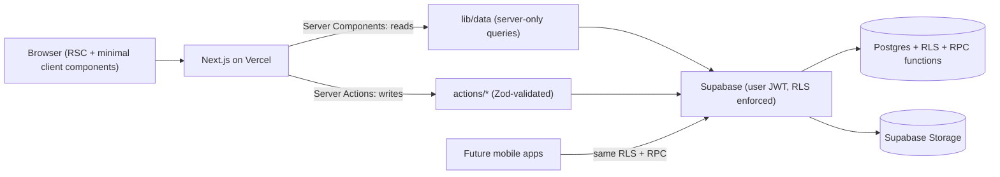
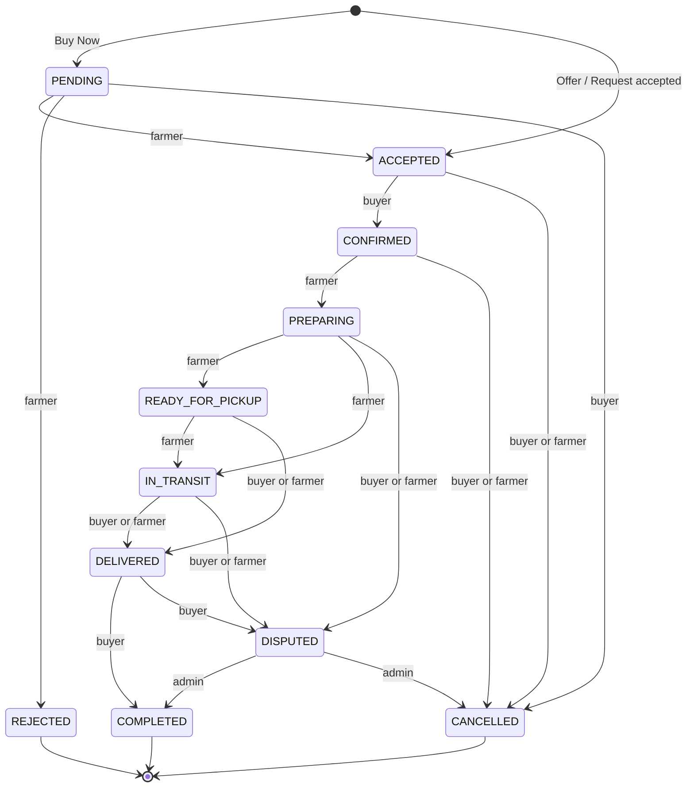

# Cropo — Phase 1: Architecture

Source of truth: [Cropo Production Architecture.md](file:///c:/Users/pc/OneDrive/Desktop/CROPO/Cropo%20Production%20Architecture.md). No code has been written in this phase.

---

## 1. Repository Inspection

| Item | Finding |
|---|---|
| Framework / dependencies | **None.** No `package.json`, no source code. |
| Files | Only `Cropo Production Architecture.md` |
| Version control | **Not a git repo** |
| Toolchain | Node `v24.18.0`, npm `11.16.0`, git `2.46.2` |
| Existing functionality to preserve | None (greenfield) |

### Conflicts / risks found

1. **File name mismatch** — you referred to `CROPO_BUILD_PLAN.md`; the only spec file is `Cropo Production Architecture.md`. I'm treating it as the same document.
2. **Project is inside OneDrive** — syncing `node_modules` / `.next` causes slow installs, file-lock (`EPERM`/`EBUSY`) errors on Windows. Recommend moving to e.g. `C:\dev\cropo` or pausing sync for this folder.
3. **Photography** — the spec requires *real* agricultural photography and forbids AI-looking imagery. My image tool produces AI-generated images, so it **should not** be used for people/produce. Real photos must come from you or licensed stock (Unsplash/Pexels, with attribution where required).
4. **Entities missing from the core list** — some required features (saved suppliers, verification submissions, disputes) need tables not named in §5. See §3.3 — needs your approval.
5. **No git** — recommend `git init` at the start of Phase 2.

---

## 2. Final Architecture



Key decisions:

- **Next.js (App Router, latest stable) + TypeScript strict + Tailwind + shadcn/ui + Lucide.**
- **All DB access uses the user's session** (anon/publishable key + JWT) so **RLS is always enforced**. The service-role key is not used in request paths; if ever needed it lives only in a `server-only` module.
- **Critical multi-step writes are Postgres functions (RPC)** — order creation, offer acceptance, status transitions, stock reservation. This makes them atomic and **reusable by future Android/iOS clients** with no extra backend.
- **Reads:** Server Components call `lib/data/*`. **Writes:** Server Actions in `actions/*` → validate → call Supabase/RPC → `revalidatePath`.
- No extra infrastructure (no separate API server, queue, Redis, ORM).

---

## 3. Database Schema

All tables: `uuid` PK (`gen_random_uuid()`), `created_at timestamptz default now()`, `updated_at` maintained by a shared trigger. Money: `numeric(12,2)`, currency `GHS` (MVP). Quantities: `numeric(12,2)` with `> 0` checks.

### 3.1 Enums (controlled status values)

| Enum | Values |
|---|---|
| `user_role` | FARMER, BUYER, ADMIN |
| `verification_status` | UNVERIFIED, PENDING, VERIFIED, REJECTED |
| `listing_status` | DRAFT, ACTIVE, PAUSED, SOLD_OUT, REMOVED |
| `produce_unit` | KG, TONNE, BAG, CRATE, BOX, BUNCH, PIECE |
| `produce_grade` | A, B, C, UNGRADED |
| `offer_status` | PENDING, ACCEPTED, REJECTED, WITHDRAWN, EXPIRED |
| `request_status` | OPEN, FULFILLED, CLOSED, CANCELLED |
| `order_source` | BUY_NOW, OFFER, REQUEST |
| `order_status` | PENDING, ACCEPTED, CONFIRMED, PREPARING, READY_FOR_PICKUP, IN_TRANSIT, DELIVERED, COMPLETED, CANCELLED, DISPUTED, REJECTED |
| `notification_type` | NEW_OFFER, OFFER_ACCEPTED, OFFER_REJECTED, NEW_ORDER, ORDER_ACCEPTED, ORDER_STATUS_CHANGED, NEW_BUYING_REQUEST, FARMER_RESPONSE |

### 3.2 Core tables (from spec §5)

| Table | Key columns | Notes |
|---|---|---|
| `profiles` | `id` (PK = `auth.users.id`), `role`, `full_name`, `phone`, `region`, `city`, `avatar_path` | Created by trigger on signup. `role` is **not user-updatable**. |
| `farmer_profiles` | `profile_id` (PK/FK), `bio`, `years_farming`, `verification_status`, `verified_at`, `verified_by` | Verification fields admin-write only |
| `buyer_profiles` | `profile_id` (PK/FK), `business_name`, `business_type`, `verification_status`, `verified_at`, `verified_by` | business_type: INDIVIDUAL, RETAILER, WHOLESALER, RESTAURANT, PROCESSOR, EXPORTER, OTHER |
| `farms` | `farmer_id`, `name`, `region`, `district`, `community`, `size_hectares`, `verification_status` | Farmer may have many farms |
| `crop_categories` | `name`, `slug` (unique), `sort_order`, `is_active` | Seeded (Vegetables, Fruits, Tubers, Grains, Legumes…) ; admin-managed |
| `listings` | `farmer_id`, `farm_id`, `category_id`, `crop_name`, `variety`, `quantity_available`, `unit`, `price_per_unit`, `currency`, `grade`, `harvest_date`, `available_date`, `region`, `city`, `description`, `delivery_available`, `status`, `search` (generated tsvector) | Verification shown is derived from farmer/farm, never set by farmer |
| `listing_images` | `listing_id`, `storage_path`, `sort_order`, `alt_text` | Max ~6 per listing |
| `offers` | `listing_id`, `buyer_id`, `farmer_id`, `quantity`, `price_per_unit`, `message`, `status`, `responded_at` | `farmer_id` denormalized for RLS |
| `buying_requests` | `buyer_id`, `category_id`, `crop_name`, `quantity`, `unit`, `desired_grade`, `destination_region`, `destination_city`, `required_by`, `target_price_per_unit` (nullable), `description`, `status` | |
| `request_offers` | `request_id`, `farmer_id`, `listing_id` (nullable), `quantity`, `price_per_unit`, `available_date`, `message`, `status` | Unique `(request_id, farmer_id)` for pending offers |
| `orders` | `order_number` (human-readable, unique), `buyer_id`, `farmer_id`, `source`, `offer_id`, `request_offer_id`, `status`, `subtotal`, `currency`, `delivery_method` (PICKUP/DELIVERY), `delivery_address`, `notes`, `cancel_reason` | Status changes only via RPC |
| `order_items` | `order_id`, `listing_id`, `crop_name` (snapshot), `unit`, `quantity`, `price_per_unit`, `line_total` | Snapshots so later listing edits don't alter orders |
| `reviews` | `order_id`, `reviewer_id`, `reviewee_id`, `rating` 1–5, `comment` | Only after COMPLETED; one per party per order |
| `notifications` | `user_id`, `type`, `title`, `body`, `link`, `read_at` | Inserted by DB functions/triggers |

**Indexes:** all FKs; `listings(status, category_id)`, `listings(region)`, `listings(price_per_unit)`, GIN on `listings.search`; `offers(farmer_id, status)`, `offers(buyer_id, status)`; `orders(buyer_id, status)`, `orders(farmer_id, status)`; `buying_requests(status, required_by)`; `notifications(user_id, read_at)`.

### 3.3 Additional tables required by spec features — **needs approval**

| Table | Why it's needed |
|---|---|
| `saved_suppliers` (`buyer_id`, `farmer_id`) | Buyer "Save suppliers" + `/dashboard/buyer/suppliers` |
| `verification_submissions` (`profile_id`, `farm_id?`, `type`, `document_paths[]`, `status`, `reviewer_id`, `review_notes`) | Farmer "Submit verification" + admin "Verification review" |
| `disputes` (`order_id`, `opened_by`, `reason`, `status`, `resolution`, `resolved_by`) | Admin "Handle disputes" |
| `order_status_history` (`order_id`, `from_status`, `to_status`, `changed_by`, `note`) | Audit trail for state machine; supports order timeline UI |

### 3.4 Order state machine (enforced in Postgres)



- Single authoritative function `transition_order(order_id, to_status, note)` (SECURITY DEFINER) checks `auth.uid()` is the allowed actor, validates the transition, writes history, and creates notifications.
- A TypeScript mirror (`lib/orders/state-machine.ts`) is used **only** to decide which buttons to show.
- **Stock:** quantity is reserved atomically (row lock) when an order is created and restored on REJECTED/CANCELLED. Listing auto-moves to SOLD_OUT at zero.
- **Decision to confirm:** Offer/Request-originated orders start at ACCEPTED (farmer already agreed); Buy Now starts at PENDING.

---

## 4. Authentication Strategy

- **Supabase Auth, email + password** (phone OTP deferred — SMS out of MVP scope).
- `@supabase/ssr` with cookie sessions; three clients: browser, server (RSC/actions), middleware.
- Middleware refreshes the session and redirects unauthenticated users away from `/dashboard/*`.
- Server code uses **`supabase.auth.getUser()`** (validated with Auth server) — never trusts `getSession()` alone.
- **Role source of truth = `profiles.role` in the DB**, never `user_metadata` (user-editable) and never client input.
- Signup: user picks Farmer or Buyer → `handle_new_user` trigger creates `profiles` + `farmer_profiles`/`buyer_profiles`; the trigger **only accepts FARMER or BUYER**. ADMIN is assigned manually via SQL.
- Helpers in `lib/auth/`: `getCurrentUser()`, `requireUser()`, `requireRole('FARMER' | 'BUYER' | 'ADMIN')` — used in every dashboard layout **and** every server action.

---

## 5. Authorization / RLS Strategy

RLS enabled on **every** table. Helper SQL functions: `auth_role()`, `is_admin()` (STABLE, SECURITY DEFINER, fixed `search_path`).

| Table | SELECT | INSERT | UPDATE | DELETE |
|---|---|---|---|---|
| profiles | self, admin; public fields via a `public_farmer_profiles` view | trigger only | self (role/verification columns blocked) | none |
| farmer/buyer_profiles | self, admin (public farmer fields via view) | trigger | self (non-verification cols); admin verification | none |
| farms | public (farmer's farms), owner, admin | owner (FARMER) | owner, admin | owner |
| crop_categories | everyone | admin | admin | admin |
| listings | ACTIVE → public; own → owner; all → admin | owner (FARMER) | owner (not verification), admin | owner (if no orders), admin |
| listing_images | follows listing | listing owner | listing owner | listing owner |
| offers | buyer or farmer party, admin | buyer (self) | via RPC only | none |
| buying_requests | OPEN → farmers; own → buyer; admin | buyer | owner | owner (if no offers) |
| request_offers | request owner, offering farmer, admin | farmer | farmer (withdraw); accept via RPC | none |
| orders / order_items / history | parties, admin | via RPC only | via RPC only | none |
| reviews | public | party of COMPLETED order | none | admin |
| notifications | recipient | functions only | recipient (`read_at`) | recipient |
| saved_suppliers | owner | owner | — | owner |
| verification_submissions | owner, admin | owner | admin | none |
| disputes | parties, admin | via RPC | admin | none |

**IDOR protection:** ownership is always derived from `auth.uid()` inside policies/RPCs, never from IDs sent by the client.

**Storage buckets:**

| Bucket | Access |
|---|---|
| `listing-images` (public read) | write/delete only under `{auth.uid()}/…`; image MIME + size limit (5 MB) |
| `avatars` (public read) | write only own folder |
| `verification-documents` (private) | owner + admin read via signed URLs |

---

## 6. Folder Structure

```text
cropo/
├── supabase/
│   ├── migrations/            # numbered SQL: enums, tables, RLS, functions, storage
│   ├── seed.sql               # categories only (+ clearly-labelled sample data if approved)
│   └── config.toml
├── public/images/             # licensed real photography
├── src/
│   ├── middleware.ts
│   ├── app/
│   │   ├── (public)/          # /, marketplace, farmers, how-it-works, about
│   │   ├── (auth)/            # login, signup
│   │   ├── dashboard/{farmer,buyer,admin}/
│   │   ├── layout.tsx, error.tsx, not-found.tsx, loading.tsx
│   ├── components/
│   │   ├── ui/                # shadcn primitives
│   │   ├── shared/            # header, footer, page-header, status-badge, empty-state, price, verified-badge
│   │   ├── marketplace/       # listing-card, filters, listing-gallery
│   │   ├── farmer/ buyer/ admin/
│   ├── actions/               # auth, profiles, listings, offers, requests, orders, admin
│   ├── lib/
│   │   ├── supabase/          # client.ts, server.ts, middleware.ts
│   │   ├── auth/              # session + role guards
│   │   ├── data/              # server-only read queries per domain
│   │   ├── orders/            # state-machine mirror
│   │   ├── validation/        # Zod schemas per domain
│   │   └── utils/             # formatting (GH₵, dates, units), errors
│   ├── types/                 # database.types.ts (generated), domain types
│   └── config/                # site, nav, regions of Ghana, units
└── .env.example
```

Adapts spec §11 with two additions: `lib/data/` (separates reads from actions) and `lib/orders/`.

---

## 7. Route Map

| Area | Routes | Guard | Rendering |
|---|---|---|---|
| Public | `/`, `/marketplace`, `/marketplace/[id]`, `/farmers/[id]`, `/how-it-works`, `/about` | none | Server, SEO metadata, `generateMetadata` for details |
| Auth | `/login`, `/signup` | redirect if logged in | Server + small client form |
| Farmer | `/dashboard/farmer` + listings, listings/new, listings/[id]/edit, offers, orders, orders/[id], earnings, profile, verification | `requireRole('FARMER')` in layout | Server, dynamic |
| Buyer | `/dashboard/buyer` + marketplace, requests, requests/new, offers, orders, orders/[id], suppliers, profile | `requireRole('BUYER')` | Server, dynamic |
| Admin | `/dashboard/admin` + farmers, buyers, listings, orders, disputes, analytics | `requireRole('ADMIN')` | Server, dynamic |
| Shared | `/dashboard` → redirects to role dashboard; `/auth/callback` (email confirm) | | |

Extra routes beyond the spec (`listings/[id]/edit`, `orders/[id]`, `/dashboard`, `/auth/callback`) are required to implement listed features.

---

## 8. Component Architecture

- **Server Components by default.** Client components only for: forms with interaction, filters (URL search-param driven), image uploader, mobile nav toggle, dialogs.
- **Marketplace filters live in the URL** (`?crop=&region=&grade=…`) → shareable, SEO-friendly, server-rendered.
- **Forms:** native `<form action={serverAction}>` + `useActionState` for field errors; no extra form library.
- **Shared primitives:** `StatusBadge` (one mapping for all enums), `VerifiedBadge`, `Price`, `Quantity`, `EmptyState`, `DataTable` (simple shadcn table), `PageHeader`.
- **Design tokens** in Tailwind theme / CSS variables: deep green primary, harvest amber accent, warm-white background, charcoal text, neutral borders; Inter (or similar) via `next/font`; moderate radius, minimal shadow; no icon animation, no gradients/glass.

---

## 9. Validation Strategy

- **Zod** (only new non-stack library; tiny, standard with shadcn) — schemas in `lib/validation/*`.
- Every Server Action: `requireRole` → `schema.safeParse(formData)` → typed error object back to form.
- Same schemas reused client-side for instant feedback where useful.
- DB is the final guard: `CHECK` constraints (positive quantity/price, dates, rating range), enums, FKs, RLS.
- Uploads: MIME + size checked client-side, server-side, and by bucket policy.

---

## 10. Error Handling & Loading

- `error.tsx` / `loading.tsx` per route segment; `not-found.tsx` for missing/hidden listings.
- Actions return `{ ok: true, data } | { ok: false, error, fieldErrors }` — never throw raw DB errors to UI.
- Postgres error codes mapped to friendly messages in `lib/utils/errors.ts`.

---

## 11. Deployment Strategy

- **Vercel** (Next.js) + **Supabase hosted** project. Choose Supabase region closest to Ghana (e.g. EU West/London) and set Vercel function region to match.
- Env vars (`.env.example` committed, `.env.local` git-ignored):
  - `NEXT_PUBLIC_SUPABASE_URL`, `NEXT_PUBLIC_SUPABASE_ANON_KEY`, `NEXT_PUBLIC_SITE_URL`
  - `SUPABASE_SERVICE_ROLE_KEY` — server-only, only if a real need appears
- Migrations via Supabase CLI (`supabase db push`); types via `supabase gen types`.
- `next/image` with Supabase Storage `remotePatterns`.
- CI gate before deploy: `tsc --noEmit`, `next lint`/ESLint, `next build`.

---

## 12. Open Questions (before Phase 2)

1. **Supabase setup:** hosted project you create (I'll need URL + anon key in `.env.local`), or local via Supabase CLI + Docker?
2. **Extra tables (§3.3):** approve all four?
3. **Photography:** will you supply photos, or should I use licensed free stock (Unsplash/Pexels)?
4. **Project location:** move out of OneDrive, or stay here?
5. **Order start state:** OK that Offer/Request orders start at ACCEPTED and Buy Now at PENDING?
